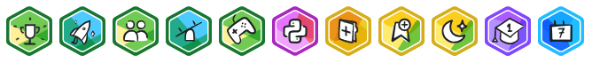

# Kaggle Competitions Repository

- Bienvenido a mi repositorio de competiciones de Kaggle. En este espacio, encontrarás diferentes carpetas que contienen el código y la documentación del proceso de creación de los modelos con los que he participado en diversas competiciones de Kaggle.

- Generalmente estan completadas con código de python y las diversas bibliotecas de ML.

# Badges



## Contenido del Repositorio

Este repositorio está estructurado de la siguiente manera:

- `/TuMejorPortatil.com`: Documentación y código de la primera competencia.
- `/¡EnseñameLaPasta!`: Documentación y código de la segunda competencia.
- `/ExploringMentalHealth`: Documentación y código de la tercera competencia.
- `/DigitRecognizer`: Documentación y código de la cuarta competencia.
- `/ChessAgent`: Documentación y código de la quinta competencia.


## Cursos


## Cómo Usar Este Repositorio

1. **Clonar el Repositorio**: 
   Puedes clonar este repositorio usando el siguiente comando:

   ```bash
   git clone https://github.com/tu_usuario/kaggle-competitions.git
